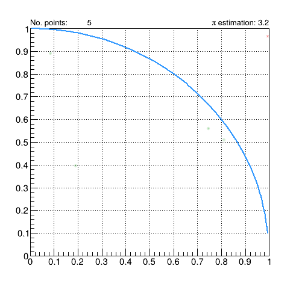

<!-- markdownlint-disable-file MD028 -->
# Laboratorio 5

In questo laboratorio faremo pratica con la generazione di numeri (pseudo-)casuali e con l'utilizzo di algoritmi della
_standard library_.

---

- [Laboratorio 5](#laboratorio-5)
  - [Area di lavoro](#area-di-lavoro)
  - [Determinazione del valore di 𝛑 con il metodo hit-or-miss](#determinazione-del-valore-di-𝛑-con-il-metodo-hit-or-miss)
    - [Descrizione del primo problema](#descrizione-del-primo-problema)
    - [Descrizione di `hit_or_miss.cpp`](#descrizione-di-hit_or_misscpp)
    - [Implementazione di `generate_points()`](#implementazione-di-generate_points)
    - [Implementazione di `compute_pi()` tramite l'algoritmo `count_if`](#implementazione-di-compute_pi-tramite-lalgoritmo-count_if)
    - [Considerazioni sui risultati ottenuti](#considerazioni-sui-risultati-ottenuti)
    - [Misura delle prestazioni del programma con il comando `time`](#misura-delle-prestazioni-del-programma-con-il-comando-time)
    - [Uso dell'algoritmo `generate_n` all'interno di `generate_points()`](#uso-dellalgoritmo-generate_n-allinterno-di-generate_points)
  - [Calcolo di statistiche per una distribuzione esponenziale](#calcolo-di-statistiche-per-una-distribuzione-esponenziale)
    - [Descrizione del secondo problema](#descrizione-del-secondo-problema)
    - [Descrizione del file `exp_stats.cpp`](#descrizione-del-file-exp_statscpp)
    - [Implementazione della funzione `generate_entries`](#implementazione-della-funzione-generate_entries)
    - [Implementazione della funzione `mean`, tramite l'algoritmo `std::accumulate`](#implementazione-della-funzione-mean-tramite-lalgoritmo-stdaccumulate)
    - [Implementazione della funzione `median`, tramite l'algoritmo `std::sort`](#implementazione-della-funzione-median-tramite-lalgoritmo-stdsort)
    - [Compilazione ed esecuzione](#compilazione-ed-esecuzione)
    - [Bonus: calcolo più efficiente della mediana, tramite l'algoritmo `std::nth_element`](#bonus-calcolo-più-efficiente-della-mediana-tramite-lalgoritmo-stdnth_element)
  - [Consegna facoltativa del lavoro svolto](#consegna-facoltativa-del-lavoro-svolto)
  - [Approfondimenti ed esercizi](#approfondimenti-ed-esercizi)

---

## Area di lavoro

Creiamo una nuova directory di lavoro (ad esempio `pf_labs/lab5`) e aggiungiamo il file `.clang-format`.
Possiamo copiarlo dalla cartella utilizzata per il quarto laboratorio:

```bash
$ pwd
/home/battilan/pf_labs/lab5
$ cp ../lab4/.clang-format .
```

> [!NOTE]
> Se non avete adottato la nomenclatura per le cartelle suggerita durante i laboratori precedenti, dovrete modificare il
> _path_ relativo indicato sopra.

Andiamo poi a copiare nell'area di lavoro la coppia di file `hit_or_miss.cpp` e `exp_stats.cpp`, contenenti le bozze dei
programmi che completeremo oggi:

```bash
$ pwd
/home/battilan/pf_labs/lab5
$ curl -sO https://raw.githubusercontent.com/Programmazione-per-la-Fisica/labs2025/main/lab5/draft/hit_or_miss.cpp
$ curl -sO https://raw.githubusercontent.com/Programmazione-per-la-Fisica/labs2025/main/lab5/draft/exp_stats.cpp
```

> [!NOTE]
> L'opzione `-s` del comando `curl` fa si che il comando venga eseguito senza produrre nessun output a schermo, mentre
> l'opzione `-O` permette di non specificare il nome del file di output e di usare automaticamente quello del file copiato.

## Determinazione del valore di 𝛑 con il metodo hit-or-miss

Il primo esercizio che affronteremo oggi consiste nello scrivere un programma che utilizza un metodo di
[integrazione Monte Carlo](https://it.wikipedia.org/wiki/Metodo_Monte_Carlo) _hit-or-miss_ per
[determinare il valore numerico di 𝛑](https://it.wikipedia.org/wiki/Metodo_Monte_Carlo#Determinazione_del_valore_%CF%80).

### Descrizione del primo problema

Dati un riquadro del piano cartesiano $x-y$ descritto da una coppia di intervalli $[x_{min}, x_{max}]$, $[y_{min}, y_{max}]$,
nonché una curva contenuta nel riquadro e descritta dalla funzione matematica $y = f(x)$, il metodo di integrazione
_hit-or-miss_ consiste nel:

- generare $N$ punti $(x_{i}, y_{i})$ **distribuiti uniformemente** all'interno del **riquadro** stesso;
- **contare il numero** $N_{pass}$ di punti così generati per i quali vale la relazione:

```math
y_{i} \le f(x_{i});
```

- derivare **l'area sottesa dalla curva** tramite la formula:  

```math
A = (x_{max} - x_{min}) \cdot(y_{max} - y_{min}) \cdot N_{pass} / N .
```

Al crescere di $N$, ci si aspetta che la determinazione di $A$ diventi via via più ragionevole.



Nel caso presentato in figura, relativo a **un quarto di circonferenza** di **raggio unitario**, abbiamo:

- $[x_{min}, y_{max}] = [0.0, 1.0]$;
- $[y_{min}, y_{max}] = [0.0, 1.0]$;
- $A =  N_{pass} / N = \pi / 4$ .

dall'ultima relazione si ottiene:

$$\pi =  N_{pass} / N \cdot 4 $$

### Descrizione di `hit_or_miss.cpp`

Aprite VScode nell'area di lavoro e leggete scheletro del programma `hit_or_miss.cpp`.

Come potrete notare:

- il programma implementa una `struct Point` che ci aiuterà per la gestione dei punti nel piano cartesiano;
- è presente una funzione `generate_points()` di cui sono **specificati argomenti e tipo di ritorno**;
- è presente una funzione `compute_pi()` di cui sono specificati **argomenti e tipo di ritorno**;
- è presente una funzione `main()` che utilizza le funzioni di cui sopra per generare `N = 100` punti e determinare
  `pi_approx`.

Le implementazioni delle funzioni `generate_points()` e `compute_pi()` sono volutamente lasciate in uno stato parziale.

Il vostro primo compito è quello di implementarle correttamente, **senza modificare argomenti e tipi di ritorno** e
**senza cambiare la funzione main**. Come al solito, forniremo lungo la traccia alcuni suggerimenti per l'implementazione.

> [!NOTE]
> Potete notare nel codice dei commenti simili a questo `//...` dove ci aspettiamo che inseriate le vostre modifiche.

All'inizio compiliamo ed eseguiamo il programma tramite i comandi:

```bash
$ g++ -Wall -Wextra hit_or_miss.cpp -o hit_or_miss
hit_or_miss.cpp: In function 'std::vector<Point> generate_points(int)':
hit_or_miss.cpp:14:40: warning: unused parameter 'n' [-Wunused-parameter]
   14 | std::vector<Point> generate_points(int n) {
      |                                    ~~~~^
hit_or_miss.cpp: In function 'double compute_pi(const std::vector<Point>&)':
hit_or_miss.cpp:22:45: warning: unused parameter 'points' [-Wunused-parameter]
   22 | double compute_pi(std::vector<Point> const& points) {
      |                   ~~~~~~~~~~~~~~~~~~~~~~~~~~^~~~~~
```

e

```bash
$ ./hit_or_miss 
Points std::vector size: 0
Approximated pi value: 0
```

Se tutto funziona come previsto potrete notare che:

- ci sono dei **_warning_ in compilazione**, dovuti alla presenza di variabili non utilizzate;
- i **risultati del programma** sono palesemente **lontani dalle aspettative**.

### Implementazione di `generate_points()`

Cominciamo quindi ad esercitarci sulla generazione di numeri _random_. Come mostrato a lezione, questo può essere fatto
tramite _random engines_ e _random distributions_, che sono parte della
[_random number library_](https://en.cppreference.com/w/cpp/numeric/random).

Non avendo esigenze particolari, in questo esempio utilizzeremo il `std::default_random_engine`.
Inoltre, ci serve introdurre un oggetto di tipo
[`std::uniform_real_distribution<double>`](https://en.cppreference.com/w/cpp/numeric/random/uniform_real_distribution)
che ci permetta di generare campioni di valori distribuiti uniformemente nell'intervallo $[0.0, 1.0]$.

Andiamo a modificare la lista di direttive `#include` e la funzione `generate_points()` in questo modo:

```c++
#include <iostream>
#include <vector>
#include <random>
...
```

e

```c++
std::vector<Point> generate_points(int n) {
  std::vector<Point> points;
  
  std::default_random_engine eng;
  std::uniform_real_distribution<double> uniform{0.0, 1.0};

  return points;
}
```

Abbiamo ora tutti gli ingredienti per popolare il vettore `points` come richiesto dall'esercizio.

Per cominciare, lo facciamo utilizzando un `for` _loop_:

```c++
...
  std::default_random_engine eng;
  std::uniform_real_distribution<double> uniform{0.0, 1.0};

  for (int i{0}; i != n; ++i) {
     points.push_back({uniform(eng), uniform(eng)});
  }

  return points;
...
```

> [!IMPORTANT]
> Notate che un singolo `default_random_engine` viene utilizzato per tutte le generazioni.
> Inoltre, per ogni chiamata a `uniform(eng)` viene generato un numero "diverso" secondo i criteri imposti durante la
> dichiarazione dell'oggetto funzione `uniform`.

Formattiamo, salviamo e compiliamo il codice:

```bash
$ g++ -Wall -Wextra -O3 hit_or_miss.cpp -o hit_or_miss
hit_or_miss.cpp: In function 'double compute_pi(const std::vector<Point>&)':
hit_or_miss.cpp:27:45: warning: unused parameter 'points' [-Wunused-parameter]
   27 | double compute_pi(std::vector<Point> const& points) {
      |                   ~~~~~~~~~~~~~~~~~~~~~~~~~~^~~~~~
```

Possiamo innanzitutto verificare che il numero di _warning_ si è ridotto, per via dell'implementazione non
banale di `generate_points()`, che fa ora uso della variabile `n`.

Inoltre, se proviamo ad eseguire il programma:

```bash
$  ./hit_or_miss 
Points std::vector size: 100
Approximated pi value: 0
```

notiamo che il vettore di punti così generato ha la dimensione desiderata, quella espressa tramite la variabile `N`.

### Implementazione di `compute_pi()` tramite l'algoritmo `count_if`

Per completare l'esercizio, procediamo ora all'implementazione della funzione `compute_pi()`.

Considerando la formula risolutiva del problema ($\pi = N_{pass} / N \cdot 4$), ci accorgiamo che l'unico ingrediente
mancante è il calcolo di $N_{pass}$ ovvero il _conteggio delle istanze di `Point` che soddisfano una data
condizione_: quella di essere contenute all'interno del quarto di circonferenza di raggio unitario centrata in
$(0, 0)$.

Scorrendo la lista degli [algoritmi forniti dalla _standard library_](https://en.cppreference.com/w/cpp/algorithm.html)
possiamo notare che [l'algoritmo `count_if`](https://en.cppreference.com/w/cpp/algorithm/count.html) permette
proprio di effettuare conteggi analoghi.

> [!TIP]
> Molto spesso, ripetere a parole quello che una data parte di programma deve fare, ci permette di capire come
> implementarla.

Andando a leggere in dettaglio la [documentazione](https://en.cppreference.com/w/cpp/algorithm/count.html) di
`count_if`, troviamo che i requisiti che l'algoritmo impone per implementare la _callable_ che opera la nostra verifica
sono:

> **p** - unary predicate which returns `true` for the required elements.
>
> The expression `p(v)` must be convertible to `bool` for every argument v of type (possibly const) VT, where VT is the
> value type of InputIt, regardless of value category, and must not modify v.

In questo caso, una funzione con i seguenti argomenti e valore di ritorno `bool FUN(Point const & p)` soddisfa
le richieste.

Per una circonferenza centrata in zero, la condizione da soddisfare durante il conteggio si riduce alla verifica che la
norma (quindi la norma al quadrato `norm2()`) di una data istanza di `Point` sia minore o uguale a `1.0`.

Andiamo quindi a implementare una funzione, che chiamiamo `is_in_circle`, fatta in questo modo:

```c++
...

bool is_in_circle(Point const & p) {
  return ... ;
}
...
```

Per poi utilizzarla nell'implementazione di `compute_pi()`, che diventa:

```c++
double compute_pi(std::vector<Point> const& points) {
  auto n = points.size();
  auto n_in_circle = std::count_if(points.begin(), points.end(), is_in_circle);

  return ... ;
}
```

Andiamo ora a compilare ed eseguire il programma:

```bash
$ g++ -Wall -Wextra hit_or_miss.cpp  -o hit_or_miss 
$ ./hit_or_miss 
Points std::vector size: 100
Approximated pi value: 3.04
```

> [!NOTE]
> Molto probabilmente, otterrete un valore per $pi$ leggermente diverso da quello riportato qui.

Prima di procedere oltre, notiamo che al posto della funzione `is_in_circle`:

```c++
  auto n_in_circle = std::count_if(points.begin(), points.end(), is_in_circle);
```

avremmo potuto utilizzare una _lambda expression_, per verificare l'appartenenza dei gli oggetti di tipo `Point` al
quarto di circonferenza:

```c++
  auto n_in_circle = std::count_if(points.begin(), points.end(), []( ... ){ ... });
```

> [!NOTE]
> L'implementazione della _lambda expression_ è lasciata a voi.
> Ricordate che:
>
> - argomenti e tipo di ritorno del predicato **p** sono definiti nella documentazione dell'algoritmo
>   `count_if` e sono gli stessi che abbiamo utilizzato quando abbiamo implementato la funzione
>   `is_in_circle`;
> - il corpo della _lambda_ deve replicare il comportamento della funzione che vogliamo sostituire.

Effettuata la sostituzione, andiamo a **compilare** ed **eseguire** il codice per verificare che questo funzione come ci
aspettiamo.

### Considerazioni sui risultati ottenuti

Provate a eseguire il codice più volte senza cambiarlo.

> [!NOTE]
>
> :question: Ottenete sempre lo stesso output su schermo? Come mai?

In realtà, la sequenza di numeri generata da un qualsiasi _random number generator_ è completamente deterministica, per
cui ci attendiamo il comportamento appena ottenuto. È però possibile variare la risposta di un _random number generator_
andando ad utilizzare _seed_ differenti durante l'inizializzazione.

In particolare, [`std::random_device`](https://en.cppreference.com/w/cpp/numeric/random/random_device) permette
tipicamente di accedere ad alcune risorse _hardware_ per generare sequenze di numeri interi "veramente" casuali
distribuite in maniera uniforme.

Però, **l'accesso a tali risorse risulta dispendioso**, pertanto è prassi utilizzare `std::random_device` solo per
inizializzare il _seed_ di un _random number generator (o engine)_.

Andiamo quindi a modificare la funzione `generate_points` nel seguente modo:

```c++
...
std::vector<Point> generate_points(int n) {
  std::vector<Point> points;
  
  std::random_device r;
  std::default_random_engine eng{r()};
  std::uniform_real_distribution<double> uniform{0.0, 1.0};
  ...
}
```

Quindi compiliamo ed eseguiamo il codice più volte senza cambiarlo.

> [!NOTE]
> :question: Come cambia il comportamento del programma rispetto a prima?

### Misura delle prestazioni del programma con il comando `time`

Incrementiamo adesso il numero di punti generati dal programma, al fine di migliorare la determinazione del valore di
$\pi$, andando a cambiare il valore di N:

```c++
...
int main() {
  int const N{1'000'000};

  auto points = generate_points(N);
...
}
```

Compiliamo ed eseguiamo nuovamente il codice.

Abbiamo verosimilmente ottenuto un **risultato migliore** del precedente, ma, così facendo abbiamo utilizzato **molte
più risorse di calcolo**. Pertanto il **tempo di esecuzione** del programma potrebbe essere **aumentato sensibilmente**,
in funzione della potenza di calcolo offerta dal portatile di ciascuno di voi.

Per le prove che vogliamo effettuare adesso, andate a variare `N` per ottenere un tempo di esecuzione attorno ad una
ventina di secondi; per farlo, possiamo avvalerci del comando `time`:

```bash
$ time ./hit_or_miss
Points std::vector size: 200000000
Approximated pi value: 3.14156
./hit_or_miss  21.51s user 0.66s system 99% cpu 22.316 total
```

> [!NOTE]
> Come potete vedere, sono comparse tre misure di tempo al di sotto del normale output del nostro programma: `real`,
> `user` e `sys`. Quella più interessante per i nostri scopi è `real`, cioè il tempo trascorso da quando abbiamo
> lanciato il comando di esecuzione del codice a quando il nostro programma è terminato.

A questo punto possiamo verificare la correttezza delle nostre scelte implementative, andando deliberatamente contro alcune
delle _best practices_ per la scrittura di codice discusse a lezione.

Ad esempio, proviamo a utilizzare direttamente il `random device rd` al posto del `std::default_random_engine eng` per la generazione di numeri _random_:

```c++
...
     points.push_back({uniform(rd), uniform(rd)});
...
```

Compilando ed eseguendo di nuovo il programma dovreste ottenere un aumento del tempo di esecuzione:

```bash
time ./hit_or_miss                                  
Points std::vector size: 200000000
Approximated pi value: 3.14181
./hit_or_miss  47.27s user 1.11s system 99% cpu 48.788 total
```

Dopo questa conferma, potete riportare il codice nel suo stato precedente.

Prima di passare al prossimo punto, provate ad aggiungere al comando di compilazione l'opzione `-O3`, che dovrebbe
migliorare sensibilmente il tempo di esecuzione:

```bash
$ g++ -Wall -Wextra hit_or_miss.cpp -o hit_or_miss -O3
$ time ./hit_or_miss                                      
Points std::vector size: 200000000
Approximated pi value: 3.14156
./hit_or_miss  4.13s user 0.30s system 93% cpu 4.724 total
```

> [!TIP]
> Se arrivate a questo punto della traccia abbastanza presto, vi suggeriamo di utilizzare il comando `time` per
> verificare la differenza di prestazioni fra le due implementazioni testate poco fa mantenendo, in entrambi i casi,
> l'opzione `-O3` all'interno del comando di compilazione.
>
> Al di là degli scopi didattici, **lo studio delle prestazioni di un programma** va sempre effettuato **utilizzando
> tutte le opzioni di compilazione** che intendiamo utilizzare per la sua **versione di produzione**.

### Uso dell'algoritmo `generate_n` all'interno di `generate_points()`

Prima di passare al prossimo esercizio notiamo che,
[controllando di nuovo la documentazione](https://en.cppreference.com/w/cpp/algorithm.html), possiamo identificare tra
gli algoritmi del gruppo _**Generation operations**_,
[`generate_n`](https://en.cppreference.com/w/cpp/algorithm/generate_n.html), che potrebbe aiutarci a migliorare
l'implementazione di  `generate_points()`.

Per verificarne il corretto utilizzo, andiamo a
[consultare la pagina relativa a tale algoritmo](https://en.cppreference.com/w/cpp/algorithm/generate_n.html), dove
impariamo che possiamo definire il comportamento della generazione tramite una _callable_ **g** fatta in questo modo:

> **g** - generator function object that will be called.
>
> The signature of the function should be equivalent to the following: `Ret fun()`
>
> The type `Ret` must be such that an object of type `OutputIt` can be dereferenced and assigned a value of type `Ret`.

In questo caso, il tipo che **g** deve restituire è `Point`.

Procediamo implementando **g** utilizzando direttamente una _lambda expression_.

Cominciamo rimuovendo la seguente parte di codice:

```c++
...
  for (int i{0}; i != n; ++i) {
     points.push_back({uniform(eng), uniform(eng)});
  }
...
```

per rimpiazzarla con:

```c++
...
  std::generate_n(std::back_inserter(points), n,
                  [ ... ] { ... });
...
```

> [!NOTE]
> Notate l'utilizzo di `std::back_inserter(p)` che di fatto esegue l'operazione di `push_back` all'interno del vettore,
> aumentandone le dimensioni.

> [!TIP]
> In questo caso, la funzione generatrice **g** non prende argomenti, ma risulta opportuno catturare alcuni oggetti
> necessari per la generazione di numeri (pseudo-)casuali.

Andiamo ora a compilare ed eseguire il programma, **verificando che si comporti come prima**.

## Calcolo di statistiche per una distribuzione esponenziale

In questo secondo esercizio, vogliamo:

- **generare** un insieme di $N$ numeri casuali distribuiti secondo una **distribuzione di probabilità esponenziale**
  con parametro $\gamma$;
- calcolare **media e mediana** del campione generato.

### Descrizione del secondo problema

La [distribuzione esponenziale](https://it.wikipedia.org/wiki/Distribuzione_esponenziale) è una distribuzione di
probabilità utilizzata per descrivere numerosi processi fisici tra cui, ad esempio, i processi di decadimento
radioattivo.

La funzione di densità di probabilità (PDF) della distribuzione esponenziale è data da:

```math
f(x; \gamma) = \gamma e^{-\gamma x} \quad \text{per } x \geq 0 \text{ e } \gamma > 0
```

dove $\gamma$ è il parametro della distribuzione, che rappresenta il tasso di decadimento.

Tra le caratteristiche della distribuzione esponenziale, si può evidenziare come la distribuzione sia **asimmetrica** e,
pertanto, **media e mediana** risultino **diverse tra loro**.

> [!NOTE]
> Rispetto all'esercizio precedente, potrete notare che la traccia di questo esercizio risulta "meno guidata".
> Si tratta di una scelta intenzionale fatta per lasciarvi più libertà nell'implementare quelle parti del programma che
> sono analoghe a quelle del primo esercizio o degli esempi discussi in aula.

### Descrizione del file `exp_stats.cpp`

Aprite VScode nell'area di lavoro e leggete scheletro del programma `exp_stats.cpp`.

In questo programma dovrete implementare le seguenti funzioni:

- `auto generate_entries(int n, double gamma) { ... }`;
- `double mean(std::vector<double> const& entries) { ... }`;
- `double median(std::vector<double> const& entries) { ... }`.

La funzione `main()`, che deve generare un campione di `N = 100'000` numeri casuali distribuiti esponenzialmente con
parametro `gamma`, e poi calcolare e stampare a video la media e la mediana del campione generato, non deve essere
modificata durante lo sviluppo delle parti mancanti del programma.

> [!NOTE]
> Dovrete implementare voi il codice al posto dei puntini `...`.

All'inizio compiliamo ed eseguiamo il programma tramite i comandi:

```bash
$ g++ -Wall -Wextra -O3 exp_stats.cpp -o exp_stats     
exp_stats.cpp: In function 'auto generate_entries(int, double)':
exp_stats.cpp:6:27: warning: unused parameter 'n' [-Wunused-parameter]
    6 | auto generate_entries(int n, double gamma) {
      |                       ~~~~^
exp_stats.cpp:6:37: warning: unused parameter 'gamma' [-Wunused-parameter]
    6 | auto generate_entries(int n, double gamma) {
      |                              ~~~~~~~^~~~~
exp_stats.cpp: In function 'double mean(const std::vector<double>&)':
exp_stats.cpp:14:40: warning: unused parameter 'entries' [-Wunused-parameter]
   14 | double mean(std::vector<double> const& entries) {
      |             ~~~~~~~~~~~~~~~~~~~~~~~~~~~^~~~~~~
exp_stats.cpp: In function 'double median(const std::vector<double>&)':
exp_stats.cpp:20:42: warning: unused parameter 'entries' [-Wunused-parameter]
   20 | double median(std::vector<double> const& entries) {
      |               ~~~~~~~~~~~~~~~~~~~~~~~~~~~^~~~~~~
```

e

```bash
$ ./exp_stats 
entries vector:
- size: 0
- mean: 0 (expected: 0.5)
- median: 0 (expected: 0.346574)
```

Anche in questo caso notiamo che ci sono **_warning_ in compilazione** (attesi) e che i **risultati** del programma
**sono sbagliati**.

### Implementazione della funzione `generate_entries`

Questa funzione (analoga a `generate_points` del primo esercizio) deve generare un vettore di `n` numeri casuali
distribuiti secondo una distribuzione esponenziale con parametro `gamma`.

Nella _random library_ del C++ è presente una _template class_ che permette di generare numeri casuali distribuiti
secondo una distribuzione esponenziale, chiamata
[`std::exponential_distribution`](https://en.cppreference.com/w/cpp/numeric/random/exponential_distribution).

> [!IMPORTANT]
> Anche in questo caso, ricordatevi che è necessario utilizzare un generatore di numeri casuali
> (`std::default_random_engine`) per ottenere numeri casuali a partire dalla distribuzione esponenziale.
> Come _seed_, potete sempre utilizzare un numero generato casualmente, utilizzando `std::random_device`.

Partendo quindi dalla funzione creata nel primo esercizio, l'implementazione della funzione `generate_entries` può
essere realizzata in questo modo:

```cpp
auto generate_entries(int n, double gamma) {
    ...
    
    std::exponential_distribution<double> exp(gamma);
    std::generate_n(std::back_inserter(...), n, [...]() { ... });
    
    ...
}
```

dove `[...]() { ... }` rappresenta la _lambda expression_ che utilizza il `std::default_random_engine` e la
distribuzione esponenziale per generare numeri (pseudo-)casuali distribuiti esponenzialmente.

### Implementazione della funzione `mean`, tramite l'algoritmo `std::accumulate`

Per calcolare la media di un insieme di numeri, è sufficiente sommare tutti gli elementi dell'insieme e dividere per il
numero totale di elementi.

Potete fare ciò, utilizzando l'algoritmo[`std::accumulate`](https://en.cppreference.com/w/cpp/algorithm/accumulate),
disponibile in `<numeric>`, all'interno della funzione mean:

```cpp
double mean(std::vector<double> const& entries) {
  ...
  return ...;
}
```

### Implementazione della funzione `median`, tramite l'algoritmo `std::sort`

Dato un campione di valori ordinabili, la [mediana](https://it.wikipedia.org/wiki/Mediana_(statistica)) (o valore
mediano) si definisce come il valore per il quale la frequenza relativa cumulata vale (o supera) 0.5 .

All'atto pratico, la mediana di un campione costituito da $N$ valori è calcolabile nel seguente modo:

1. si ordinano gli $N$ valori in modo crescente;
2. se $N$ è dispari: la mediana corrisponde al valore centrale, che occupa la posizione $N/2$ del campione ordinato;
3. se $N$ è pari: la mediana è definita come la media aritmetica dei valori che occupano le posizioni $N/2 - 1$ ed
   $N/2$.

Per ordinare i numeri, potete utilizzare l'algoritmo [`std::sort`](https://en.cppreference.com/w/cpp/algorithm/sort),
disponibile in `<algorithm>`. Dopo aver ordinato i numeri, potete calcolare la mediana scegliendo la formula appropriata
in base al fatto che il numero totale di elementi sia pari o dispari.

Un possibile esempio di implementazione della funzione `median` è il seguente:

```cpp
double median(std::vector<double> const& entries) {
  auto e_sorted{entries};
  ...

  std::sort(e_sorted.begin(), e_sorted.end());

  return n % 2 == 0 ? ... : ...; // calcolo della mediana in base al numero di elementi (pari o dispari)
}
```

### Compilazione ed esecuzione

Una volta completato il codice, potete compilare ed eseguire il programma utilizzando i seguenti comandi da terminale:

```bash
$ g++ -Wall -Wextra -O3 exp_stats.cpp -o exp_stats
```

verificando che non ci siano errori di compilazione, e poi:

```bash
$ ./exp_stats
entries vector:
- size: 100000
- mean: 0.49833 (expected: 0.5)
- median: 0.346374 (expected: 0.346574)
```

> [!TIP]
> Commentate il risultato ottenuto, o discutetelo insieme a docenti e tutor.

> [!TIP]
> Verificate che il risultato sia compatibile con il valore atteso della media e della mediana di una distribuzione
> esponenziale, che trovate [qui](https://en.wikipedia.org/wiki/Exponential_distribution#Mean,_variance,_moments,_and_median).

### Bonus: calcolo più efficiente della mediana, tramite l'algoritmo `std::nth_element`

Per calcolare la mediana, abbiamo dovuto ordinare gli elementi del vettore di punti.
Questa può risultare un'operazione particolarmente dispendiosa, specialmente se il vettore contiene molti elementi.

Nel calcolo della mediana è possibile usare l'algoritmo [`std::nth_element`](https://en.cppreference.com/w/cpp/algorithm/nth_element),
che permette di evitare l'ordinamento completo del vettore.
Questo algoritmo esegue un **ordinamento parziale**: dato un range `[first, last)` e un iteratore `nth`, riordina gli
elementi in modo che:

- l’elemento in posizione `nth` sia esattamente quello che si troverebbe lì se l’intero range fosse ordinato;
- tutti gli elementi prima di `nth` (`[first, nth)`) siano minori o uguali a questo elemento (senza essere
  necessariamente ordinati tra loro);
- tutti gli elementi dopo `nth` (`[nth, last)`) siano maggiori o uguali a questo elemento (anche qui senza ordine
  interno garantito).

In questo modo si può ottenere direttamente la mediana, **senza il costo di un ordinamento completo**.

> [!IMPORTANT]
> :question: Perché questo approccio risulta essere migliore rispetto al calcolo della mediana che sfrutta `std::sort`?
> Discutetene tra di voi e poi chiedete conferma ai tutor o ai docenti.

> [!IMPORTANT]
> L'implementazione di questo metodo può essere eseguita utilizzando due volte `std::nth_element`, nel caso di un
> vettore con un numero pari di elementi. In alternativa, vi invitiamo ad esplorare l'utilizzo di `std::nth_element` per
> identificare uno dei due elementi e di [`std::max_element`](https://en.cppreference.com/w/cpp/algorithm/max_element)
> per identificare il secondo elemento.

Salvate, compilate ed eseguite nuovamente il programma, verificando che i risultati ottenuti siano corretti e
compatibili con quelli ottenuti in precedenza.

> [!TIP]
> Vi suggeriamo di utilizzare il comando `time` per giudicare la differenza di prestazioni fra le due implementazioni
> del calcolo della mediana. In questo caso, ricordate di compilare il codice utilizzando l'opzione `-O3` e modificate
> il valore di `N` in modo che l'esecuzione del programma avvenga in un tempo dell'ordine della decina di secondi.

## Consegna facoltativa del lavoro svolto

Per chi lo desiderasse, è possibile effettuare una consegna **facoltativa** del lavoro svolto durante il laboratorio.
Questa è un'opzione che lasciamo a quegli studenti che, incerti su alcuni punti, vogliono chiarire i loro dubbi.

Le consegne **non verranno valutate** e **NON contribuiscono al risultato dell'esame**.

Tutti coloro che effettuano una consegna facoltativa, sono pregati di **riportare**, **come commento** alla consegna
stessa, **dubbi o domande sull'elaborato per i quali è richiesto feedback** esplicito da parte dei docenti.

La consegna deve avvenire, da parte dei singoli studenti, tramite
[questo link per il canale A-L](https://virtuale.unibo.it/mod/assign/view.php?id=2081703) e
[questo link per il canale M-Z](https://virtuale.unibo.it/mod/assign/view.php?id=2092152) i quali prevedono il solo
caricamento di file `.zip` o `.tgz`.

Supponendo che tutto il materiale sia nella cartella `lab5` (e supponendo di trovarsi in tale cartella), per creare un
archivio `.zip` procedere come segue:

```bash
$ pwd
/home/battilan/pf_labs/lab5
$ cd ..
$ zip -r lab5.zip lab5
$ ls
lab5 lab5.zip
```

Per creare un archivio `.tgz` procedere invece come segue:

```bash
$ pwd
/home/battilan/pf_labs/lab5
$ cd ..
$ tar czvf lab5.tgz lab5
$ ls
lab5 lab5.tgz
```

## Approfondimenti ed esercizi

Per chi fosse interessato a "sperimentare ulteriormente" gli argomenti presentati in questo laboratorio, vengono
proposti dei possibili approfondimenti opzionali:

- estendete il programma `exp_stats.cpp` in modo da calcolare altre statistiche; nel farlo raggruppate tutti i calcoli
  all'interno di una unica funzione `stats` che deve restituire i risultati organizzati all'interno di una struct
  `Statistics`;
- risolvete il problema
  [_remove special characters_](https://github.com/Programmazione-per-la-Fisica/exercises/tree/main/problemi/removeSpecialCharacters)
  utilizzando dapprima cicli, poi algoritmi.
